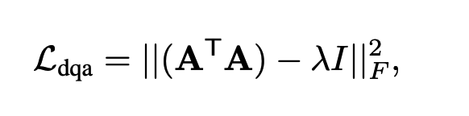

# awesome-TemporalGrounding
时序定位的一些论文综述@align

## 1.Local-Global Video-Text Interactions for Temporal Grounding
### Motivation:
1.就是对于定位这种align，我们可以利用好query中的多个有意义的phrase。（local/global）
phrase比如“the woman，actions”？

2.而这个想法却没有这么尝试过。使用attention的肯定能力上也有些损失@定位最discriminative semantic phrase。

### 经典的framework见这里的figure b'

这里就是产生若干个proposal，然后进行匹配而已。

### 我们的框架

### 1.Encoders
question很简单就是lstm啦。然后video就是分成若干clip（有重叠），然后每个都是C3D提取特征加上对应的position embedding得到最后的结果。因为是定位问题，所以咱们的position还是很有意义的。

### 2.Sequential Query Attention Network SQAN
首先就是自己生成了一系列的semantic phrase feature@针对
n step（其实就是word-level weighted sum）。

#### 2.1. Individual semantic phrase understanding
这里就是希望segment feature 与这个semantic 相关的能够被highlight，与之无关的可以suppress。因为每个segment只有16frames。所以我们介绍了local context modeling@考虑了individual segments的邻居。
这里就是两个时序卷积针对之前的hadamard product的结果的feature进行一个improvement。

#### 2.2. Relation modeling between semantic phrases（global context modeling）
Nonlocal就是针对每个block进行一个context表达。然后就是softmax。

#### 重点就是关于attention主导的queryloss(Frobenius本质就是矩阵元素平方和)

这里就是Frobenius norm of a matrix.A LxN就是concatenated query attention weights across N steps。
lambda属于【0，1】，1表示更接近onehot～（他们这里算了0.1-1）小一点效果比较显著。@实验结果
这里就是越大attn约束性越强。

## 2.Where Does It Exist: Spatio-Temporal Video Grounding for Multi-form Sentences.（就是包括了declaration/interrogative sentence depicting an object）直接描述一个物体的句子或者是一个疑问句，我们做的事bbx的时空定位
### Motivation:
1.我们需要从untrimmed video中定位到这个object

2.multi-form sentences包括explicit和implicit。

3.现有的方法无法解决这个问题因为缺乏有效的tube pre-generation和缺乏object relationship modeling.

### 我们的方法的优势
1.object可能只存在于一个很小的segment，其次就是sentences可能只是描述了queried object一个小片段。这里就说明决定这个temporal boundary是很重要的。

2.对于疑问句只能依赖于relationship between unknown objects和other objects。那么足够的关系推理是很重要的。

### 1.Video and Text encoder
就是N frames的video每个frame抽取k regions，然后还有对应的bbx vector。然后还获得了整个frame的feature。

关于sentence的表达就比较复杂。就是除了bigru之后，我们针对每个句子选择一个entity word，比如描述性的就是那个具体的object，然后非描述性的就是第一个问句。

### 2.Spatial-Temporal Graph Encoder
这里的想法就是我们必须引入relationship。with T spatio-temporal convolution layers。

### 2.1 Graph创建
implicit spatial subgraph和explicit，以及对应的temporal dynamic subgraph。

#### 2.1.1 Implicit Spatial Graph
这里就是全连接graph/（无向/unlabeled edges in each frame）

#### 2.2.2 Explicit Spatial Graph
这里就是结合Faster-RCNN得到的各种graph有关的东西。

#### 2.2.3 Temporal Dynamic Graph
就是capture the dynamics and transformation of objects across frames。
对于每个frame t，我们connect region with 最近的Mx2个frame的object。太遥远的无法提供real-time dynamics。

这里就是同时考虑appearance similarity和对应的spatial overlap。远的更容易被feature similarity而决定。
每个frame只将其与最相邻的object进行link。

#### 3.2.2 Multi-step Cross-modal Graph Reasoning
首先就是cross-modal fusion
  这里就是attn生成的query表达。（就是和region相似的）然后使用textual gate去削减text-irrelevant regions。
然后就是graph convolution。
  首先就是implict spatial，这里没有什么特别的，就是简单的weighted sum就好。
  但是explict，就是attn score由relaton决定#query。

然后就是temporal
  但是explict，就是attn score由relaton决定#query。
 
这里就是简单的堆叠啊就行。

## 3.Reasoning Step-by-Step: Temporal Sentence Localization in Videos via Deep Rectification-Modulation Network
### 3.1. Motivation@deep rectification-modulation network（RWN）
之前的那种single attention不足够去捕捉复杂的video contents以及restrict the higher-level reasoning demand。

不同于
