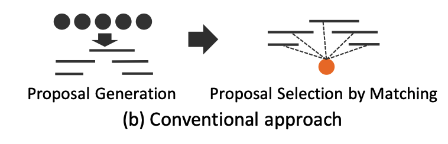
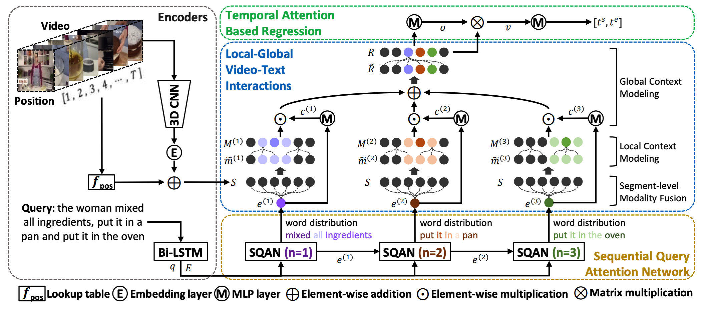

# awesome-TemporalGrounding
时序定位的一些论文综述@align

## 1.Local-Global Video-Text Interactions for Temporal Grounding
### Motivation:
1.就是对于定位这种align，我们可以利用好query中的多个有意义的phrase。（local/global）
phrase比如“the woman，actions”？

2.而这个想法却没有这么尝试过。使用attention的肯定能力上也有些损失@定位最discriminative semantic phrase。

### 经典的framework见这里的figure b'

这里就是产生若干个proposal，然后进行匹配而已。

### 我们的框架

### 1.Encoders
question很简单就是lstm啦。然后video就是分成若干clip（有重叠），然后每个都是C3D提取特征加上对应的position embedding得到最后的结果。因为是定位问题，所以咱们的position还是很有意义的。

### 2.Sequential Query Attention Network SQAN
首先就是自己生成了一系列的semantic phrase feature@针对
n step（其实就是word-level weighted sum）。

#### 2.1. Individual semantic phrase understanding
这里就是希望segment feature 与这个semantic 相关的能够被highlight，与之无关的可以suppress。因为每个segment只有16frames。所以我们介绍了local context modeling@考虑了individual segments的邻居。
这里就是两个时序卷积针对之前的hadamard product的结果的feature进行一个improvement。

#### 2.2. Relation modeling between semantic phrases（global context modeling）
Nonlocal就是针对每个block进行一个context表达。然后就是softmax。

#### 重点就是关于attention主导的queryloss(Frobenius本质就是矩阵元素平方和)

这里就是Frobenius norm of a matrix.A LxN就是concatenated query attention weights across N steps。
lambda属于【0，1】，1表示更接近onehot～（他们这里算了0.1-1）小一点效果比较显著。@实验结果
这里就是越大attn约束性越强。

