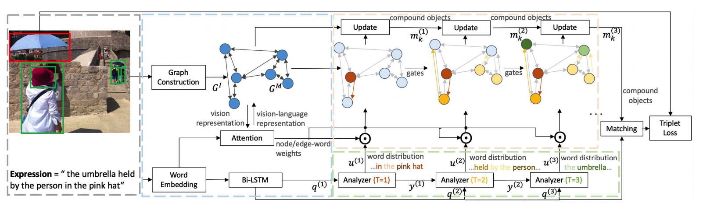

# awesome-TemporalGrounding
时序定位的一些论文综述@align

## 1.Local-Global Video-Text Interactions for Temporal Grounding
### Motivation:
1.就是对于定位这种align，我们可以利用好query中的多个有意义的phrase。（local/global）
phrase比如“the woman，actions”？

2.而这个想法却没有这么尝试过。使用attention的肯定能力上也有些损失@定位最discriminative semantic phrase。

### 经典的framework见这里的figure b'


这里就是产生若干个proposal，然后进行匹配而已。

### 我们的框架


### 1.Encoders
question很简单就是lstm啦。然后video就是分成若干clip（有重叠），然后每个都是C3D提取特征加上对应的position embedding得到最后的结果。因为是定位问题，所以咱们的position还是很有意义的。

### 2.Sequential Query Attention Network SQAN
首先就是自己生成了一系列的semantic phrase feature@针对
n step（其实就是word-level weighted sum）。

#### 2.1. Individual semantic phrase understanding
这里就是希望segment feature 与这个semantic 相关的能够被highlight，与之无关的可以suppress。因为每个segment只有16frames。所以我们介绍了local context modeling@考虑了individual segments的邻居。
这里就是两个时序卷积针对之前的hadamard product的结果的feature进行一个improvement。

#### 2.2. Relation modeling between semantic phrases（global context modeling）
Nonlocal就是针对每个block进行一个context表达。然后就是softmax。

#### 重点就是关于attention主导的queryloss(Frobenius本质就是矩阵元素平方和)


这里就是Frobenius norm of a matrix.A LxN就是concatenated query attention weights across N steps。
lambda属于【0，1】，1表示更接近onehot～（他们这里算了0.1-1）小一点效果比较显著。@实验结果
这里就是越大attn约束性越强。

## 2.Where Does It Exist: Spatio-Temporal Video Grounding for Multi-form Sentences.（就是包括了declaration/interrogative sentence depicting an object）直接描述一个物体的句子或者是一个疑问句，我们做的事bbx的时空定位
### Motivation:
1.我们需要从untrimmed video中定位到这个object

2.multi-form sentences包括explicit和implicit。

3.现有的方法无法解决这个问题因为缺乏有效的tube pre-generation和缺乏object relationship modeling.

### 我们的方法的优势
1.object可能只存在于一个很小的segment，其次就是sentences可能只是描述了queried object一个小片段。这里就说明决定这个temporal boundary是很重要的。

2.对于疑问句只能依赖于relationship between unknown objects和other objects。那么足够的关系推理是很重要的。

### 1.Video and Text encoder
就是N frames的video每个frame抽取k regions，然后还有对应的bbx vector。然后还获得了整个frame的feature。

关于sentence的表达就比较复杂。就是除了bigru之后，我们针对每个句子选择一个entity word，比如描述性的就是那个具体的object，然后非描述性的就是第一个问句。

### 2.Spatial-Temporal Graph Encoder
这里的想法就是我们必须引入relationship。with T spatio-temporal convolution layers。

### 2.1 Graph创建
implicit spatial subgraph和explicit，以及对应的temporal dynamic subgraph。

#### 2.1.1 Implicit Spatial Graph
这里就是全连接graph/（无向/unlabeled edges in each frame）

#### 2.2.2 Explicit Spatial Graph
这里就是结合Faster-RCNN得到的各种graph有关的东西。

#### 2.2.3 Temporal Dynamic Graph
就是capture the dynamics and transformation of objects across frames。
对于每个frame t，我们connect region with 最近的Mx2个frame的object。太遥远的无法提供real-time dynamics。


这里就是同时考虑appearance similarity和对应的spatial overlap。远的更容易被feature similarity而决定。
每个frame只将其与最相邻的object进行link。

#### 3.2.2 Multi-step Cross-modal Graph Reasoning
首先就是cross-modal fusion
  这里就是attn生成的query表达。（就是和region相似的）然后使用textual gate去削减text-irrelevant regions。
然后就是graph convolution。
  首先就是implict spatial，这里没有什么特别的，就是简单的weighted sum就好。
  但是explict，就是attn score由relaton决定#query。

然后就是temporal
  但是explict，就是attn score由relaton决定#query。
 
这里就是简单的堆叠啊就行。

## 3.Reasoning Step-by-Step: Temporal Sentence Localization in Videos via Deep Rectification-Modulation Network
### 3.1. Motivation@deep rectification-modulation network（RWN）
之前的那种single attention不足够去捕捉复杂的video contents以及restrict the higher-level reasoning demand。

不同于

# 4.Visual-Semantic Graph Matching for Visual Grounding
最常见的任务就是referring expression comprehension以及phrase localization.

REC:这个任务就是ground a object@referring expression 定位

Phrase Localization:这里就是ground all noun phrases@image description 里面的所有名词来定位图像中的objects。

而所有这样的任务都是很困难的，因为我们需要去全方位理解textual semantics和visual concepts，然后建模semantics和concepts之间的相似性，然后找到他们对应的相关性@one-to-one mapping.
### 1.Motivation:
1.我们将这个问题当作是一种graph matching的工作，其中为了reduce他们的discrepancy，我们就是使用cross-modal GCN来学习上下文信息。

2.先前的工作大多数都是尝试建模object-phrase相似性而不是找到他们对应的correspondences in a global manner，这样就会导致matching ambiguity.

3.那么我这里就是formulate视觉定位是一个两个graph之间的关系，这里就是同时object-phrase level，以及global-level@graph。

这里就是如果两个图可以很好的匹配的话，那么align工作@对于每个node就可以取得很好的效果了。

### 2.这个idea后面的挑战
1.node和edge of这两个图是异质空间的，因此很难直接matching，由于gap between language domain以及vision domain.

2.graph matching就是被当作是一个quadratic assignment programming问题，那么是一个NP-hard combinatorial optimization问题。

### 我们的尝试
1.同时学习两个图的节点表达，然后找到他们的correspondences 4 visual grounding.@这里就是novel 跨模态graph卷积网络去学习统一的节点表示。（这里就是直接characterize both节点信息依旧对应的implicit结构信息来减少两个异质graph之间的区别）

2.考虑到节点表达are enriched with structure information，graph matching问题就被当作是一个linear assignment的问题了。

3.对于phrase localization，我们就是介绍了一个permutation loss去解决linear assignment问题。

4.对于rec，gt node correspondences for graph matching是不可能的，因为context objects@句子中的可决定referred object是没有label的，因此除了传统的referent object matching，我们介绍了一个semantic cycle-consistency loss，就是可以鼓励one-to-one mapping between the two graphs in a 半监督的方式。


## Graph 创建
对于image，我们就是each node就是一个object，然后edge 就是对应的visual relationship～这里就是计算node和node之间的distance，然后其中top-5的intra-class objects就被用来当作是intra-class edge，top-5的inter-class-objects就被用来当作inter-class edge。这个edge就很简单，就是relative spatial information。

对于sentence，我们就是rule-based scene graph parser，

# 5.G^3raphGround:Graph-based Language Grounding@ICCV2019
grounding of phrases in images
## 1.Motivation:
1.这里我们就是使用graph支持更加complex，non-sequential dependencies among proposal image regions and phrases。

2.这里就是intra-modal dependencies using a separate graph nn @each modality的关系信息，然后就是conditional message-passing in another graph去融合他们的outputs并且capture跨模态的关系。

3.这里就是成功many-to-many matching，可以定位single phrase to multiple image regions and vice versa。

### 我们的方法简介
1.首先就是CNN和bbx into node features of the @visual graph;

2.然后phrases就是similarly encoded@使用BIRNN@@phrase graph

3.然后edge weights则是由corresponding node features以及global image/caption context来预测的。

4.接着就是使用Gated GNN来改进整个的表达@通过一种信息传递的方式～

5.然后这个refined 表达就被用来创建fusion graph@对于每个phrase而言我们融合visualgraph的信息和对应的selected phrase。

6.然后整个融合的特征就是通过GGNN来进行迭代改进的。

7.然后就是这个融合的特征@<phrase,image_region>拿来去预测对应的grounding phrasei<->image_region.

8.接着就是使用NMS来进一步改进是否一个given phrase可以ground 1个或者更多的regions。

### 针对的问题
主要就是many-to-many的phrase grounding，我们就是single phrase可以定位到多个regions，或者多个phrases可以定位到一个image region。
我们就是使用RPN来搞定visual graph以及birnn来搞定phrase encoder。caption信息以及full image信息可以提供额外的信息来学习edge-weights(边的权重)@both graphs。

这里的fused graph就是使用两个graph的node embedding拼接在一起来预测binary decision。

### 3.1. Text and Visual Encoders
1.Phrase Encoder
我们就是假设所有的phrase都是available的并且需要被grounded，我们使用GloVe+BiRNN来进行encode～@这里就是咱们的phrase encoding～

2.Caption Encoder
这里就是使用其他的birnn来encode全部的输入caption然后获得了对应的caption encoding。因为这是很有用的因为它能够提供全局的上下文信息@phrase可能缺乏了。

3.Visual Encoder
RPN+VGG+FC3

4.Image Encoder
VGG-FC3

### 3.2. G^3raphGround Network
1.Phrase Graph:这里就是使得对于每个phrase的ground descision都基于caption中的其他phrases。（上下文信息呗）
这里的graph就是对应caption中的phrase
然后就是引入对应的关系信息，咱们使用的是phrase embedding之和，以及caption embedding还有image embedding来进行gate gnn传播～（这里使用的GRU来进行传播）

2.Visual Graph:这里就是使得咱们使用visual object+对应的坐标@4个角，然后使用同上引入caption还有image信息来做gate gnn传播～（这里使用GRU进行传播）

3.Fusion Graph: 这里就是concatenate在一起使用GNN进行信息传播～

# 6.Dynamic Graph Attention for Referring Expression Comprehension@ICCV2019
这个任务是compositional并且需要visual reasoning@关系推理among the objects in the image～
## 1.Motivation:
1.现有的方法虽然就是guided by linguistic structure，但是目前的reasoning大多只是将objects in isolation或者仅仅探索了first-order的关系。而没有aligned with the可能的复杂的expression。（因此很难直接自使用用来complex referring expressions）

## 2.我们的工作
1.我们做的事情就是提出一个Dynamic Graph Attention Network (DGA) 去获得一个high-level理解@expression and the image；（多步推理@interactions between expression and image）。
我们的DGA主要来自三个point:
```
1)expression decomposition based on linguistic structure;
2)object relationships modeling;
3)multi-step reasoning.
```
2.首先我们就是解析language 结构@expression，因此这个直接指导视觉推理步骤@@找到referent。但是我们很难直接解析语言结构，因此expression往往是复杂和灵活的。因此我们使用一个可微分的分析模块去预测constituent expressions of 输入expression@@@step by step。（因此，我们的输入expression被表示成一序列的constituent expressions）。

3.我们必须关注图像中的object关系。（我们的DGA就是一个有向graph）

4.我们的DGA performs reasoning over the 图结构（under expressions的指导下），然后我们取得了higher-order 关系among the objects，然后更新compound objects@通过图传递。



### 关于解释性reasoning的工作的介绍
1.pairwise relation@关系网络；

2.attention distirbution不同@step-wise。

3.分解整个推理步骤into序列的subtasks然后使用不同的模块网络来处理每个subtask。

不同于以前的工作，我们就是不只是将sequence当作是a sequence of words，同时考虑了expression的linguistic 结构。（我们采用的是一个可微分的analyzer 模块去动态分解expression成its constituent expressions）

### 3.1. *Language-Guided Visual Reasoning Process*这里很有趣@visual reasoning
这里就是使用referring expressions来包含rich dependency and nested linguistic structure来进一步guide 视觉推理过程。

1.这里就是解析语法关系among the words in an expression，但是现有的language parsers不是那么实用。

2.我们就是model an expression作为序列的constituent expressions以及对应的规则来combine他们.（每个子组成部分就是soft distribution over the words）

整个过程就是和MAC的control unit进行一样的操作，然后得到了对于每一个step的query vector之后将其和上一步的question vector拼接在一起获得一个新的向量。
[q^t,y^(t-1)].

然后就是计算和当前的每个word的相似性，然后获得了weighted sum-》我们可以理解为子部分@linguistic部分～（也作为下一步的输入）

### 3.2. Static Graph Attention
首先就是创建一个directed Graph G^I over the visual objects in the image～
节点就是和visual object有关，edge表示objects之间的关系～

然后就是DGA attends the words in the expression over the nodes and edges of the graph

最后就是建立一个多模态图G^M，G^I就是建模了dependency among objects in the image；
而G^M就是增强G^I 通过表达interaction between the expression and the image。

### 3.2.1 graph 创建
scene graph很好创建的，就是edge就是spatial的11labels。

### 3.2.2 *Static Attention（判断word到底是什么，而作的weighted sum）*
这里就是使用根据word是否是relation还是entity，生成对应多模态graph所必须要的文本模态的编码。然后这里就是针对关系做了一个自适应的softmax。

然后将x和现在的生成文本的feature作一个融合。


### 然后就是dynamic matching

# 7.Neighbourhood Watch: Referring Expression Comprehension via Language-Guided GAT@CVPR2019
这里就是learn a discriminative object feature that can adapt to the expression used。
## Motivation
1.对于指代消解这种单个词组的操作不仅需要理解哪个object，而需要建模一些object之间的关系才能够理解整个referring expression。（这里就是比如The child held by a woman beside a table.）
可以看出来其实可能需要一个物体和其他两个物体的关系。

## Contribution
1.我们就是提出一个language-guided graph attention network（LGRAN）强调相关的content。

2.graph attention主要包含了两个main components
1）node attention@强调了相关的objects。
2）edge attention@识别出expression种表现的object relationship。
同时edge attention被划分为intra-class edge attention and inter-class edge attention 去区分相同类别的object以及不同类别的object之间的关系。

这两种关系是语义上不同的。

3.那么就是我们总结了attended sub-graph centred on a潜在的object of interest，我们就可以动态增强对应的object的表达@@这样就可以自适应expression。


### LGRAN主要由三个模块组成
1.Language Self-attention Module: 
这里就是一个自注意力机制分解整个expression into三个模块，包括subject，intra-class relationships以及inter-class relationships。

2.language-guided gat#然后强调了与expression有关的node和edge @@@（under 前面的三个feature）
3.matching module: 这里就是计算expression-to-object matching score～

### 3.1. Language Self-attention Module:
语言比如output of a LSTM就是会忽略内部所蕴含的丰富信息。

我们受到一些工作的启发，我们也可以把这个compound language分解成substructures。（因为包括了subject，relationship我们就分解成三个embedding～）

这里就是三种attention来结合了对应的embedding～（hidden state）。

### 3.2.1 Graph Construction（图像仅仅nearby）
这里就是考虑到object一般仅仅只是interact with objects nearby，所以我们是通过node之间的相似性定义topk的邻居，这里为了efficiency和representation的balance，我们这里就是做了一个tradeoff～（k=5）

然后这里就是证明了这个spatial对于关系学习的improve很有效～

### 3.2.2 Language-guided Graph Attention
1) Node Attention：
这里就是启发于bottom-up attn，
这里就是所谓的question-aware node attention啦。

2）Intra-class edge attention:
这里就是attention values for intra-class edges以及对应的inter-class edges。
这里对于每个node的邻居咱们的关系都是question-aware relation。

3）inter-class edge attention：
这里就是咱们的edge attention（不过这次额外的考虑了邻居的node embedding）。

### 3.2.3 The Attended Graph Representation
那么这里就是获取了三种级别的表达。（一种就是object-level，然后还有intra-class level的edge weighted sum，还有inter-class level的edge weighted sum。

然后就是三种matching～

# 8.DRG: Dual Relation Graph for Human-Object Interaction Detection（HOI）
没有利用好上下文信息去predict each HOI in isolation是ambiguous的。所以我们利用一个dual relation graph。
## Motivation:
这里就是以前的densely connected graph还是比较繁琐的，因此我们就是可以尝试使用两个graph，一个是human-centric，一个是object-centric以一种更加sparse的情况获取更好的表达～

